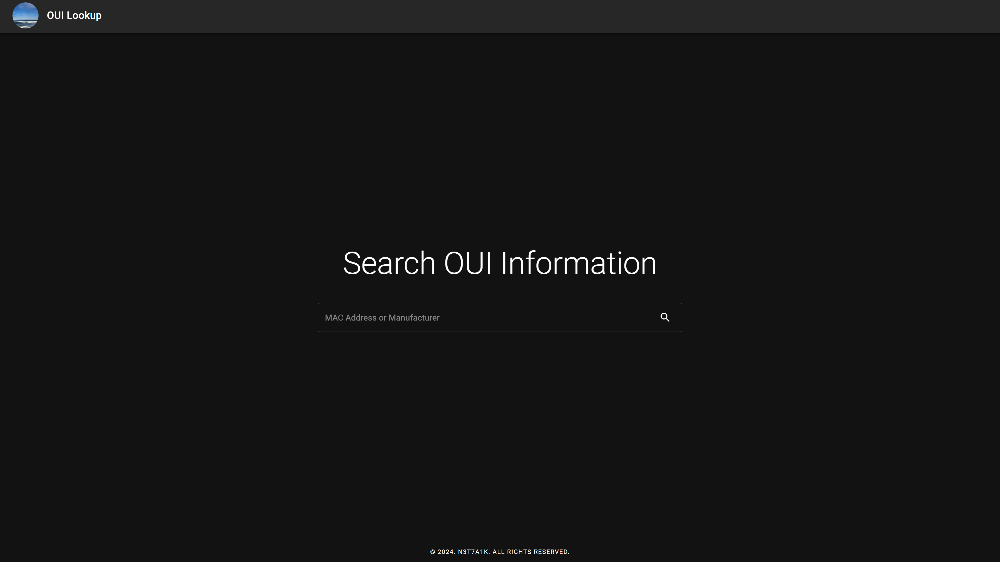
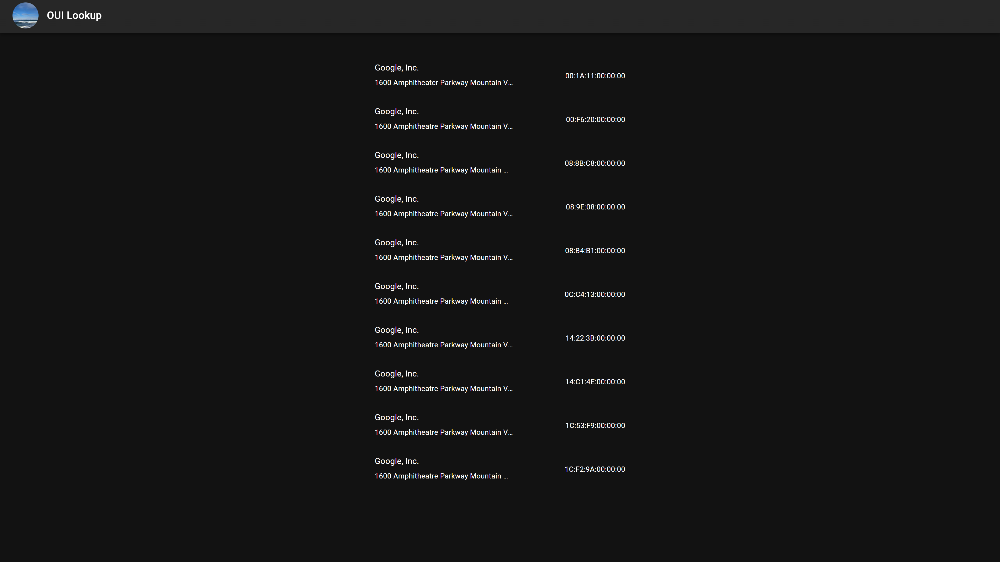

# OUI Lookup

A web service for looking up OUI (Organizationally Unique Identifier) information by MAC address or manufacturer name.




## Structure

```
OUI-Lookup/
├── api/        # Python Flask REST API
└── webui/      # Next.js Web UI
```

## Quick Start

### Docker Compose (Recommended)

```bash
docker compose up -d
```

- Web UI: http://localhost:3000
- API: http://localhost:5000

### Environment Variables

| Variable | Description | Default |
|---|---|---|
| `WORKERS` | Number of Gunicorn workers | `4` |
| `CORS_DOMAINS` | Allowed CORS domains (comma-separated) | `*` |

## Docker Hub

| Image | Description |
|---|---|
| [`n3t7a1k/oui-lookup`](https://hub.docker.com/r/n3t7a1k/oui-lookup) | API server |
| [`n3t7a1k/oui-lookup-webui`](https://hub.docker.com/r/n3t7a1k/oui-lookup-webui) | Web UI |

```bash
docker pull n3t7a1k/oui-lookup:latest
docker pull n3t7a1k/oui-lookup-webui:latest
```

## API

See [api/README.md](api/README.md) for full API documentation.

**Basic endpoints**

```bash
# Lookup by MAC address or OUI prefix
GET /oui?q=001A2B

# Lookup by manufacturer name
GET /oui?q=Samsung

# Check database status
GET /status
```

## Live

[oui.nettalk.io](https://oui.nettalk.io)
